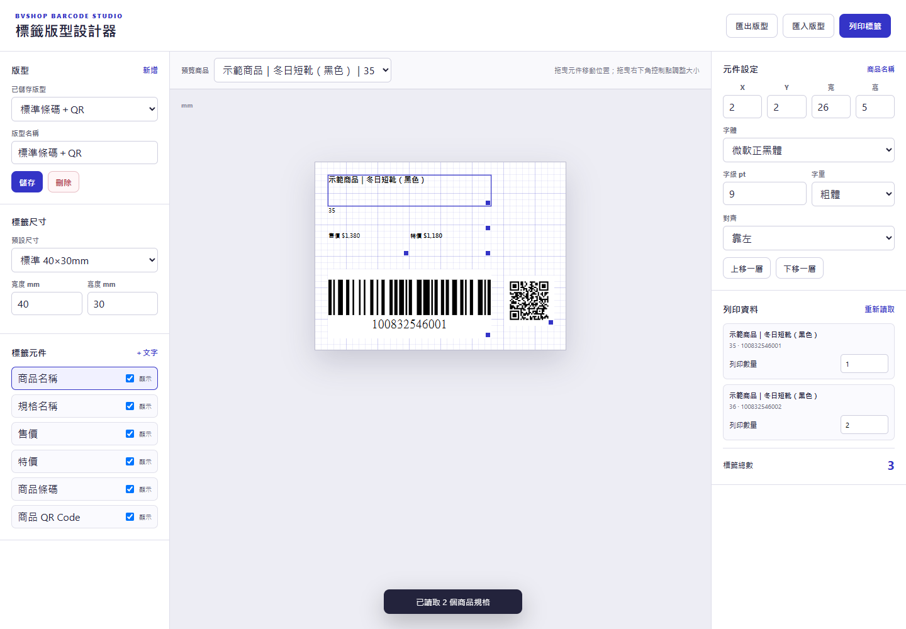

# BVSHOP Barcode Studio

為 BVSHOP 商品設計、儲存並列印包含條碼與商品 QR Code 的自訂標籤。

擴充套件會從 BVSHOP 原有的「列印條碼」視窗讀取商品名稱、規格、價格、條碼、列印數量與商品網址，再交給獨立的版型設計器處理。條碼與 QR Code 都在瀏覽器本機產生，不會把商品資料傳送給第三方服務。

## 主要功能

- 拖曳商品名稱、規格、售價、特價、條碼、QR Code 與自訂文字
- 拖曳右下角控制點調整每個元件的尺寸
- 設定元件的 X／Y 位置、寬度及高度（mm）
- 設定字體、字級、字重與文字對齊
- 40×30mm、40×25mm、Brother 42×29mm 及自訂標籤尺寸
- 即時切換不同商品規格預覽
- 個別調整每個規格的列印數量
- 儲存多套版型，並以 JSON 匯入／匯出
- 由插件直接產生 CODE128 條碼與商品 QR Code
- 保留原有的「BVSHOP 條碼＋QR」快速列印模式

## 下載

請到 [Releases](https://github.com/Mountain-P/bvshop-barcode-qr-extension/releases/latest) 下載最新版 `bvshop-barcode-qr-extension.zip`。

## 快速安裝

1. 解壓縮下載的 ZIP。
2. 在 Chrome 網址列輸入 `chrome://extensions/`。
3. 開啟右上角的「開發人員模式」。
4. 點「載入未封裝項目」。
5. 選擇解壓縮後的 `bvshop-barcode-qr-extension` 資料夾。

完整步驟請看：[安裝與版型設計教學](安裝教學.md)

## 使用版型設計器

1. 開啟 BVSHOP 後台的「商品列表」。
2. 點商品的「列印條碼」。
3. 設定各規格的列印數量。
4. 點「開啟標籤版型設計器」。
5. 在畫布上拖曳、縮放元件，並在右側設定字體與尺寸。
6. 視需要儲存版型。
7. 點右上角「列印標籤」。

也可以點 Chrome 工具列上的擴充套件圖示，重新開啟設計器。設計器會讀取最近一次從 BVSHOP 取得的商品資料。

## 第一次正式列印前

不同條碼機的可列印邊界與 DPI 不同，請先印一張測試標籤：

- Chrome 列印縮放設為 `100%`
- 邊界選擇「無」或印表機預設
- 紙張尺寸與設計器的標籤尺寸一致
- 建議條碼寬度至少 20mm
- 建議 QR Code 至少 8×8mm
- 分別使用手機與條碼掃描器測試

## 隱私與權限

擴充套件只在 `https://bvshop-manage.bvshop.tw/` 執行，商品資料、暫存列印資料與自訂版型都只儲存在 Chrome 本機。

擴充套件不會：

- 讀取或保存 BVSHOP 帳號密碼
- 呼叫第三方條碼或 QR Code API
- 將商品資料傳送到外部伺服器
- 自動送出訂單或修改商品資料

## 專案內容

- `content.js`：讀取 BVSHOP 商品及列印資料
- `designer.html`／`designer.css`／`designer.js`：版型設計、預覽與列印
- `background.js`：開啟設計器頁面
- `styles.css`：BVSHOP 列印視窗與快速列印樣式
- `popup.html`／`popup.js`：擴充套件狀態與入口
- `vendor/qrcode-generator.js`：本機 QR Code 產生器
- `vendor/jsbarcode.all.min.js`：本機 CODE128 條碼產生器

## 第三方元件

本專案包含 `qrcode-generator` 1.4.4 與 `JsBarcode` 3.11.6，兩者皆採 MIT License。完整授權資訊請見 [THIRD_PARTY_NOTICES.txt](THIRD_PARTY_NOTICES.txt)。

## 版本

- 2.0.0 — 新增完整標籤版型設計器
- 1.0.0 — 首次公開版本
